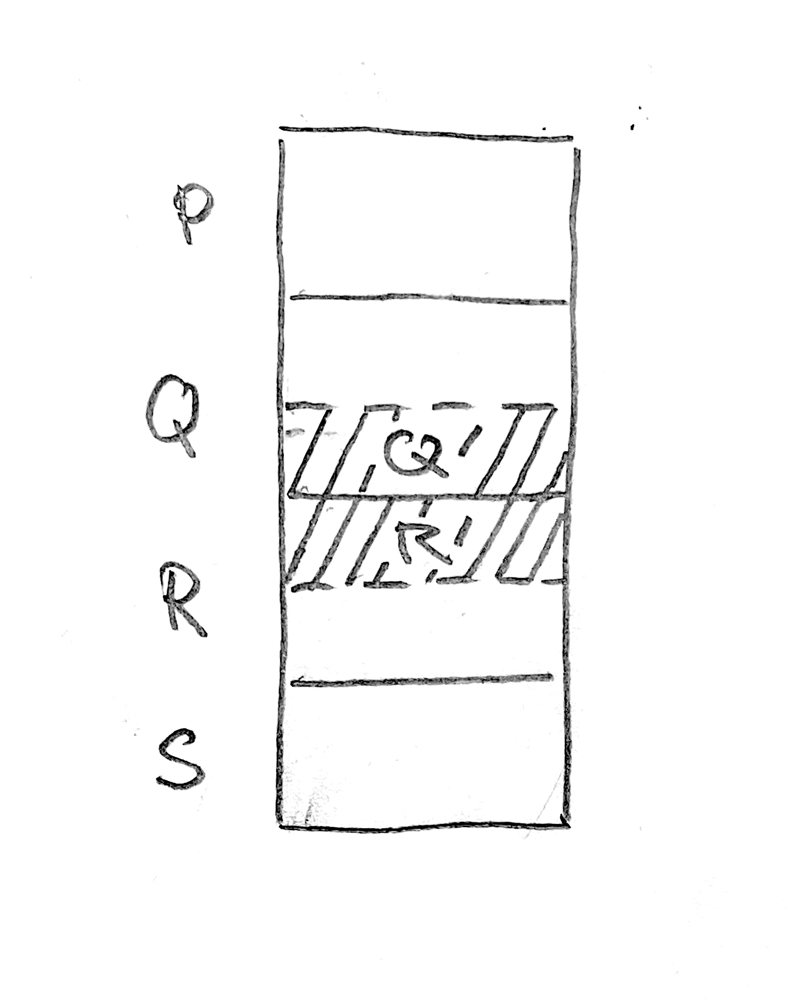
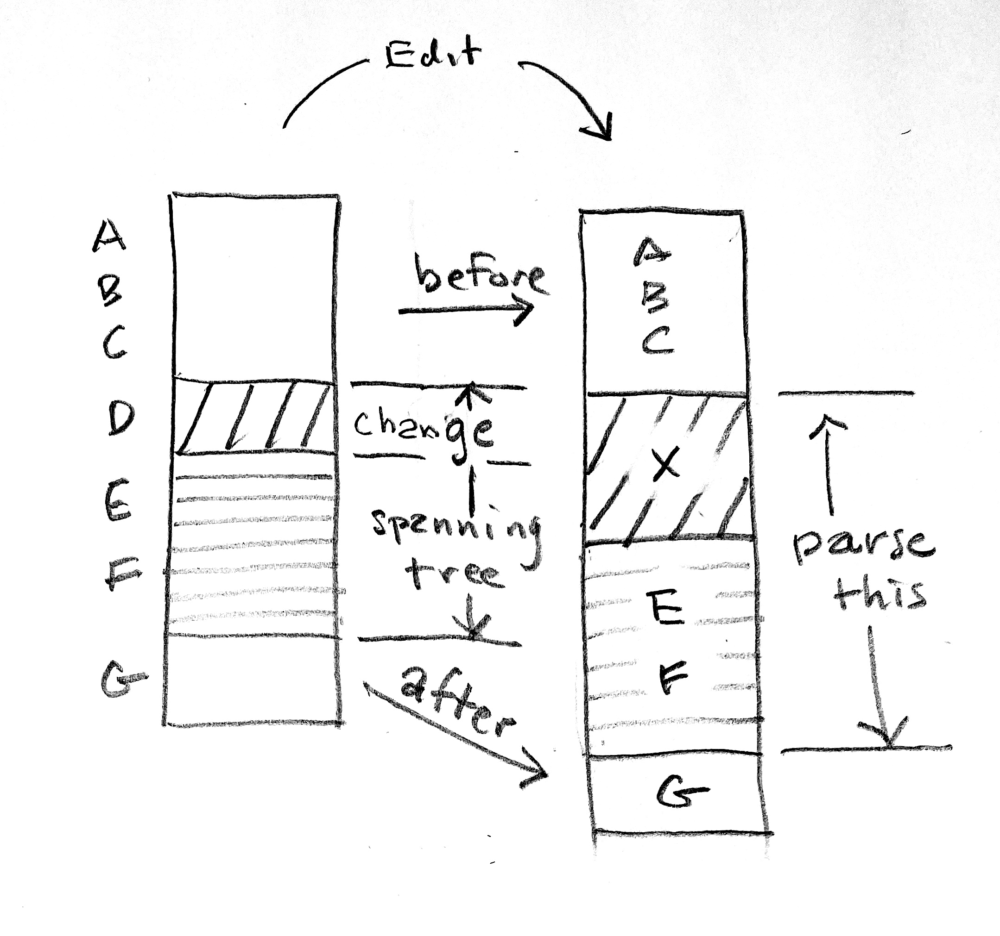
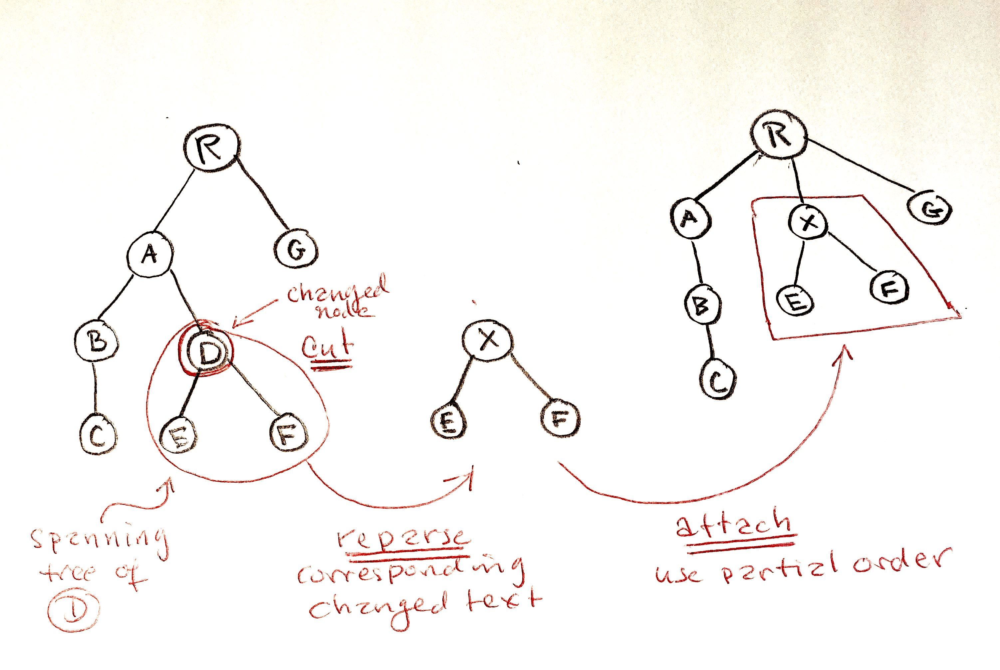

# Incremental Parsing for a Family of Block-structured Markup Languages

Below we describe a family of block-structured
markup languages and a system for parsing
their source text to a tree of blocks.  The system is
modular.  There are three main "engine" modules,
`Block`, `Parse`, and `Edit` which expose the working 
parts.  The Block language is defined entirely in a module
`BlockType`. Suppose, for examle that we have modules

```elm
BlockType.LanguageA
BlockType.LanguageB
```

To use, say, LanguageA, one must have the line

```elm
import BlockType.LanguageB as BlockType exposing (BlockType(..))
```

in the files

```elm
BLParser.Parse
BLParser.Block
```


Thus, to parse a different 
language, it suffices to use a different `BlockType` module.
Note that a complete parser requires an additional step
which transforms blocks, taking into account whatever
inline elements there are in the markup language.  For this one
must define a suitable type `AugmentedBlock` 
and a function

```elm
parseInline : Block -> AugmentedBlock
```

which is mapped over `Tree Block`.  The main function in 
each of the two modules is implemented
as a state machine operating on lines.
As discussed in section 6, the parser is *injective*,
so that the source can be recovered verbatim from the
parse tree.  There is also a module `Edit` exposing
a function which implements incremental parsing.
By *incremental*, we mean that when the source text is edited, one does not have to re-parse the entire document
to obtain a valid parse tree.  Generally only a small amount of text must be re-parsed. Such a capability makes possible interactive editing of documents which which are parsed, then rendered in real time. This is explained in section 10. The implementation language is 
[Elm](https:elm-lang.org), a statically typed
language of pure functions.


## Contents

1. Sample Text and Language Definition
2. BlockParser 
3. Recognizing Blocks
4. Arranging the blocks in a tree
5. The partial order
6. Finite State Machines
7. Annotated String Arrays and Source Maps
8. Injectivity
9. Interactive use (Elm repl)
10. Incremental Parsing
11. Tests and Benchmarks


## 1 Sample Text and Language Definition

Markup and LaTeX are block-structured markup languages. 
To set the context, below is a snippet of text
in another possible markup language, and below that
is the language definition.


```text
| section Intro

Let's talk about matter 

| subsection Atoms 

The are tiny!

| subsubsection Hydrogen

It has one proton.

| subsubsection Helium

It has two protons.
People use it to fill baloons
at birthday parties.


| section Quantum Mechanics

We need QM to understand atoms. Here is the
Heisenberg Uncertainty Principle:

| math 
[ \\hat x, \\hat p ] = i \\hbar
```


### 1.1 Language Definition

The language is defined by three elements:

1. The *BlockType*
2. A *partial order* on BlockTypes
3. A function that determines the BlockType from a list of words 
   in the first non-blank line in a block.


### 1.2 BlockType

```elm

type BlockType
    = Root
    | Section Int
    | Paragraph
    | None
```

### 1.3 A Partial Order on BlockTypes

```elm
order : BlockType -> BlockType -> Order
order a b =
    case ( a, b ) of
        ( Root, Section _ ) ->
            GT

        ( Root, Paragraph ) ->
            GT

        ( Section _, Root ) ->
            LT

        ( Section i, Section j ) ->
            if i < j then
                GT

            else if i > j then
                LT

            else
                EQ

        ( Section _, Paragraph ) ->
            GT

        ( Paragraph, Root ) ->
            LT

        ( Paragraph, Section _ ) ->
            LT

        ( None, None ) ->
            EQ

        ( None, _ ) ->
            LT

        ( _, _ ) ->
            EQ
  ```          

### 1.4 Detecting the BlockType

```elm
blockType : List String -> BlockType
blockType args =
    case List.head args of
        Nothing ->
            None

        Just arg ->
            case arg of
                "section" ->
                    Section 1

                "subsection" ->
                    Section 2

                "subsubsection" ->
                    Section 3

                "subsubsubsection" ->
                    Section 4

                _ ->
                    Paragraph

```


## 2 BlockParser

The function `parseStringArray` transforms an array of lines of 
source text for a block markup language into a tree of blocks.  


We describe four 
kinds of blocks.  Specific languages may used a subset
of these kinds.

- **Ordinary paragraphs**, consisting of contiguous
  non-blank lines with a blank line before and after. 

- **Tight blocks**.  These are like ordinary paragraphs, 
  but where the first line, the *block header,* has
  a special meaning. Here is an example:
  
  ```text
  | math
  a^2 + b^2 = c^2
  ```
  
  The pipe character signals the beginning of the tight
  block.  Everything after this "signal" string is regarded
  as an argument or argument list to the block header.  In this
  case, the argument list is empty.  The remaining lines
  in the block constitute the *body* of the block.  One 
  can configure things so that leading space before the 
  signal string is significant, e.g., defines a "level,"
  as in Markup.
  This is accomplished in the implementation of the 
  `classify` function described below.
  
- **Loose blocks**.  These may consist of more than one paragraph.
  The body of a loose block is terminated when (i) a block header 
  of higher level is scanned by the parser, or (ii)
  a block terminator is encountered.  In the example
  below, the block terminator would be `.quotation`, 
  where this word begins in column 1.  Block level
  is a partial order on block types, to be discussed below.ted
  

  ```text
  | quotation (Abraham Lincoln)
  
  Four score and seven years ago ...
  
  Now we are engaged in a great civil war ...
  
  But, in a larger sense
  
  | subsection Comments
  ``` 
  
- **Delimited blocks**.  These are like LaTeX environments, signaled
   by definite begin and end strings, e.g. `\begin{` and `\end{`
  
In the examples above, blocks are signaled by the
pipe character.  However, any leading string
can in principle could be used, as can be 
a mix of such.  Thus Markdown-style blocks such 
as the below can be accommodated:

```text

# Section 
## Subsection 
- List element 
    - Next level list element

```

## 3. Recognizing Blocks

Blocks are recognized by the function

```elm
Block.get : Int -> Array String -> Block
```
The first argument is the line number at which
to beginning scanning for a valid block in the
array given in the second argument. The
return type is defined as follows:

```elm
type alias Block =
    { blockStart : Int -- index in source array
    , blockEnd : Int -- index in source array
    , array : Array String -- the body of the block, from a slice of the source array
    , id : Maybe Id
    , blockType : BlockType  -- derived from the block header
    }
```
The `Id` is a tuple `(Int, Int)`, which should 
be thought of as `(version, blockId)`, where the first
component is used to version edits,
and where the second is a unique identifier for the block.
`BlockType` depends on the definition of the 
markup language.   Below we display the type used for 
a language whose source text looks like this:

```elm
type BlockType
    = None
    | Paragraph
    | Section Int (List String)
    | Math
    | Quotation (List String)
    | Environment (List String)
    | Document
```

The operation of `Block.get` is controlled by 
the function
  
```elm
classify : Int -> String -> Line
```  

where
  
```elm
type alias Line =
    { lineNumber : Int
    , content : String
    , lineType : LineType
    }
```
  

and 

```elm
type LineType
    = Blank
    | Text
    | BlockHeading (List String)
    | BlockEnd String
```

## 4. Arranging the blocks in a tree

The function `BlockParser.parseStringArray` takes an
array of strings
as argument and produces a `Tree Block` as output.
To do this, one sets up a  `Stack BlockType` and 
a `Tree.Zipper Block`, where the latter holds the 
tree that is being built up.  New blocks, which are 
obtained by `Block.get` are always added as a child
of a node in the right-most subtree.  We shall
call this the *spine* of the tree.  The spine
is a connected tree where each node has
at most one child. The stack is 
a representation of a segment of the spine.  When
a new block is acquired by `Block.get`, its insertion
point in the spine is determined by examining the
stack. Blocks are subject to a partial order defined
on their `BlockTypes`. A new block is inserted as the
child of the smallest node "in" the stack which is 
greater than the new block.  Two operations, 
`push` and `pop`, operate jointly on the stack + 
zipper structure to carry out insertion of a new block.  The `pop`
operation is used when necessary to bring the 
correct node into the focus of the zipper.  The 
`push` operation does the actual insertion.  At then
end of a `push`, the block type of the new 
node is on the top of the stack and the new node
is the focus of the zipper. A `pop` operation removes the top 
of the stack and moves the focus of the zipper to its parent
 so that its
block type is at this point on the top of the stack.

## 5. The partial order

As noted above, the manner in which blocks are arranged
in a tree depends on a partial order of block types.
In the type described above, `None` is the least element
and `Document` is the greatest. Any `Section` (section, subsection,
etc.) dominates
`Paragraph`, `Math`, `Quotation`, and `Environment`, while
the latter are not comparable.  Different choices of partial
order give different results: the same blocks, but 
arranged in a different tree.

## 6. State Machines

Both `Block.get` and `BlockParser.parseSource` are
implemented as state machines using the general
construct 

```elm
type Step state a
    = Loop state
    | Done a


loop : state -> (state -> Step state a) -> a
loop s nextState =
    case nextState s of
        Loop s_ ->
            loop s_ nextState

        Done b ->
            b
```
In the case of `Block.get`, the type of the state is
given by


```elm
type alias BlockState =
    { currentLineNumber : Int
    , array : Array String
    , blockStart : Int
    , blockEnd : Int
    , arrayLength : Int
    , scanning : BlockScanState
    , blockType : BlockType
    , blockKind : BlockKind
    }
```

In the case of `BLParse.parseSource`, it the state
given by 

```elm
type alias ParserState =
    { bzs : BlockZipperState
    , array : Array String
    , cursor : Int
    , arrayLength : Int
    , counter : Int
    , id : Maybe Id
    }
```

These machines operate on the level of lines rather
than the level of characters.  


## 7. Annotated String Arrays and Source Maps

To make effective use of a markup language parser
in an interactive editor or IDE, one needs a way of relating
lines of source text to nodes in the parse tree and 
*vice versa.*   To this end, use
 
```elm
sourceMapFromTree : Tree Block -> Array (Maybe Id)
```
to compute 

```elm
sourceMap : Array (Maybe Id)
```

The sourceMap has the property that the line at 
index `k` in the source is a line of the block with `id = sourceMap[k]`.
To look up the block corresponding to a given line, use 

```elm
getNodeAtLine : Array (Maybe Id) -> Int 
                 -> Tree Block -> Maybe Block
```

To go in the other direction, one can find 
the beginning and ending indices
of the source array corresponding to a given `Id` using

```elm
getArraySegment : Id -> Tree Block -> Maybe ( Int, Int )
```

To get the node itself, use

```elm
getNode : Id -> Tree Block -> Maybe Block
``` 

## 8. Injectivity

An *injective* parser 

```elm
parseStringArray : Array String -> Tree Block
```

is one for which there is a left inverse

```elm
toStringArray: Tree Block -> Array String
```

That is, 

```elm
toStringArray << parseStringArray = identity
```
where `<<` is Elm's composition operator and
`identity` means the identity on `Array String`

Injective parsers have the nice property that the 
array of source text can be recovered from the parse tree.
To test injectivty, define 

```elm
isInjective : String -> Bool
isInjective str =
    let
        array =
            Block.arrayFromString str

        qIdentity =
            toStringArray << parseStringArray

        array2 =
            qIdentity array
    in
    array2 == array
```

Then one has, for example

```text
> List.map isInjective [text1, text2, text3, text4]
[True,True,True,True]
```

## 9. Interactive use (Elm repl)

Good for experimenting ...

```elm
$ elm repl
> import BlockParser exposing(..)
> import Text exposing(..)
> t2 -- See what this text looks like
> parseString t2 -- Parse it. Lot's of stuff
> parseString t2 |> toStringTree -- easier to read
> parseString t2 |> toTaggedStringTree -- gives depth info
> parseString text4 |> toBlockTypeTree  -- Return a tree representing (BlockType, depth of node)
```

## 10. Incremental Parsing

Incremental parsing is implemented in the module `BLParse.Edit` by a function 


```elm
    edit : Int -> Int -> Source -> ParserState -> Maybe ParserState
    edit from to insertionText parserState = ...
```

It operates by replacing the source text between lines `from` and `to` with the `insertionText`, returning a `Just ParserState` value if successful and `Nothing` otherwise.  If `insertionText` is empty, this is a pure delete operation.  If `from == to`, it is a pure insertion.  Otherwise it is a replacement.

### 10.1 Normalizaton

The figure below  displays a part of the source text where each box represents a sequence of lines that belong to the block with the indicated id.  Thus the  first sequence might consist of the four lines that constitute the source of the block in the AST with id *P*.  Suppose that `from` and `to` define the 
sequence *Q'R'* wnich is to be edited.  Since it is not coextensive
with the lines of a set of boxes, we expand it to the sequence 
*QR* which does satisfy this property.  Such an
*edit sequence* is said to be *normalized*.  Its boundaries are given
by integers *from_* and *to_* which are computed by a function. 


```elm
    expand : SourceMap -> Int -> Int -> (Int, Int)
    expand sourceMap from to = ..
```




### 10.2 Example

Let us work out an example, where we assume that the 
Consider source text as indicated schematically in the table below.
The first column gives the line number, the second the block id,
and the the indicates the block type — *s* for section, *ss* for
subsection, and *t* for text.  There are many blank lines, e.g,
line 2, which separated blocks A and B.


```
   0 A s
   1 A s
   2 B ss
   3 B ss
   4 C t
   5 C t
   6 D ss
   7 D ss
   8 E t
   9 E t
   10 F t
   11 F t
   12 G s
   13 G 2
```

Its parse tree is as in the figure below, where **R** indicates
the root node.


Suppose now that the text representd by 

```
   6 D ss
   7 D ss
```

is replaced by text represented b 

```
   6 X s
   7 X s
```

This is a normalized edit.  Simple though it is, it
is sufficient to illustrate the general principles
of operation. 

### 10.3 New Source Text

Let **S** denote the original source text in the example.
The first task is to compute the new source text **S'**,
along with a subdivision into regions which will
be used to compute the updated parse tree and
source map.  These regions are labeled in the 
diagram below.  The region *ABC* which constitutes
the text before *D* is used verbatim  in **S'**.  The next 
step is to find the spanning tree of the node *D*
and the sequence of lines in the source corresponding
to it.  This is the sequence *DEF*.  If *X* is the 
insertion text, then *XEF* will be used in **S'**. 
What remains in this case is the region *G*.  Thus
the parts of **S'** are *ABC, XEF, G*.



### 10.4 New Parse Tree

We now show how to compute the parse tree corresponding 
to **S'** without parsing it in its entirety.  To this
end, let **T** denote the original parse tree, and let 
**T'** denote the tree to be computed.

1. Let **T(D)** be the subtree of  **T** spanned by the 
   node  *D*, and let **T'(D)** = **T** - **T(D)** be the 
   tree obtained by detaching the subtree.
2. Parse the text *XEF* to obtain the tree **T(X)** with root *X*.
3. Attach **T(X)** to **T'(D)** to form **T'**.  That is
   **T'** = **T'(D)** + **T(X)**.
  



Attachment of **T(X)** to **T'(D)** uses the partial
order to guide the subtree into position.  The rules are

1. *X* is attached to the least ancestor *P* of *D* such that 
   *P > D*.
2. Suppose that *X* is attached at *P*.  There is an
   ancestor *Q* of *D* that is a child of *P*.  Then
   *X* must be immediately to the right of *Q*.  That is, 
   the children of *P* are *[..., Q, X, ...]*. 

## 11. Tests and Benchmarks

There is a small test suite in `./tests`.  The 
results in `./benchmarks` are listed below.
The size of the inputs are

```text
   text4        33 line
   text4X10     339 lines
   text4X100   3399 lines
```

Parsing is by far the slowest operation.

### 11.1 parseStringWithVersion

```text
   text4,    3568 runs/sec     : 0.3 ms/run
   text4X10,  344 runs/sec     : 2.9 ms/run

   text4 has 33 lines          : 9.0 microseconds/line
   text4X10 has 339 lines      : 8.7 microseconds/line
```

The time complexity appears to be roughly linear in the 
size of the input, as measured by the number of lines.

### 11.2 sourceMapFromTree and getNode

On text4X10:

```text
     sourceMapFromTree    7489 runs/sec  : 134 microseconds
     getNode             16719 runs/sec  :  60 microseconds
``` 

On text4X100:

```text
    sourceMapFromTree    686 runs/sec   :  1.5 milliseconds  (11.2 x text4X10)
    getNode             2044 runs/sec   :  0.5 milliseconds   (8.3 x text410)
```

The time complexity appears to be roughly linear in the size of the source
as measured by number of lines.


