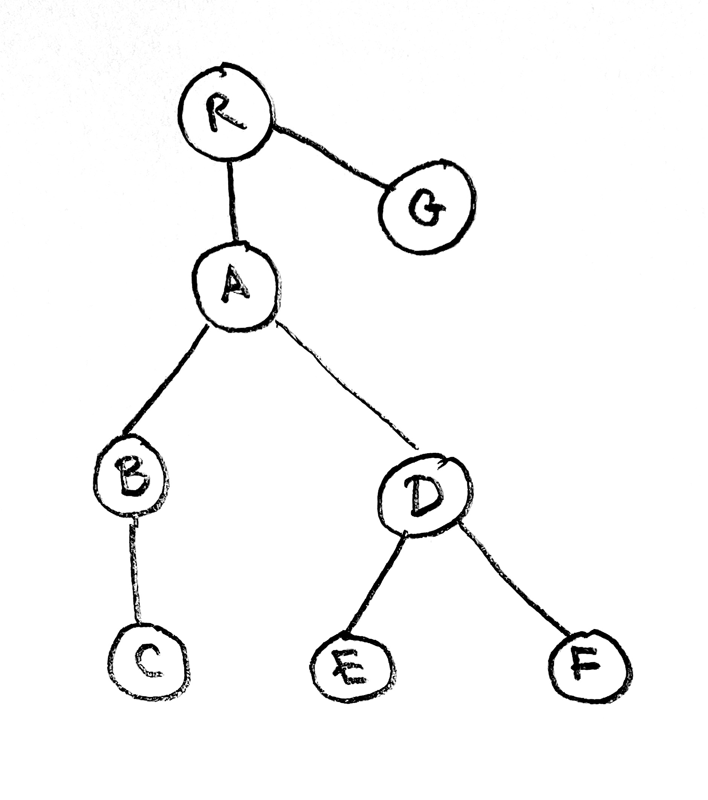

# An Iterative Parser

This document describes the design of an incremental parser for the block-structured
markup languages discussed in the README.  By *incremental*, we mean that if 
when the source text is edited, one does not have to re-parse the entire document
to obtain a valid parse tree.  Such a capability makes possible interactive editing
of documents which which are parsed, then rendered in real time. The idea is as follows.
The source text is given as an array of lines.  A first parsing of the
document produces an abstract syntax tree (AST) where the nodes are of type `Block`:

```elm
type Block
    = Block
        { id : Maybe Id
        , blockType : BlockType
        , blockStart : Int
        , blockEnd : Int
        , source : Source
        }
```
Here `Source` is basically and array of strings.  Each block has a uniqe `Id` which serves
to identify it in the parse tree.  When the text is parsed, various other structures
are computed, among which is a `sourceMap`, which is an array of `Id`.  The source map provides
a mapping from the source to the AST.  It also gives a skeletal view of the source, eg., 

```
sourceMap:
0 A
1 A
2 B
3 B
4 B
5 C
etc.
```

Thus lines 0 and 1 belong to the node with id `A`, while lines 2, 3, and 4 belong to the node with id `B`, 
etc. Below is a slightly more detailed skeletal view.  In the first column is the line number.  It is followed
by the identifier of the block to which it belongs and shorthand for the block type: s for section, ss for subsection,
and t for text.  

```
0 A s
1 A s
2 B ss
3 B ss
4 C t
5 C t
6 D ss
7 D ss
8 E t
9 E t
10 F t
11 F t
12 G s
13 G 2
```

The parse tree for this text is as illustrated below.


